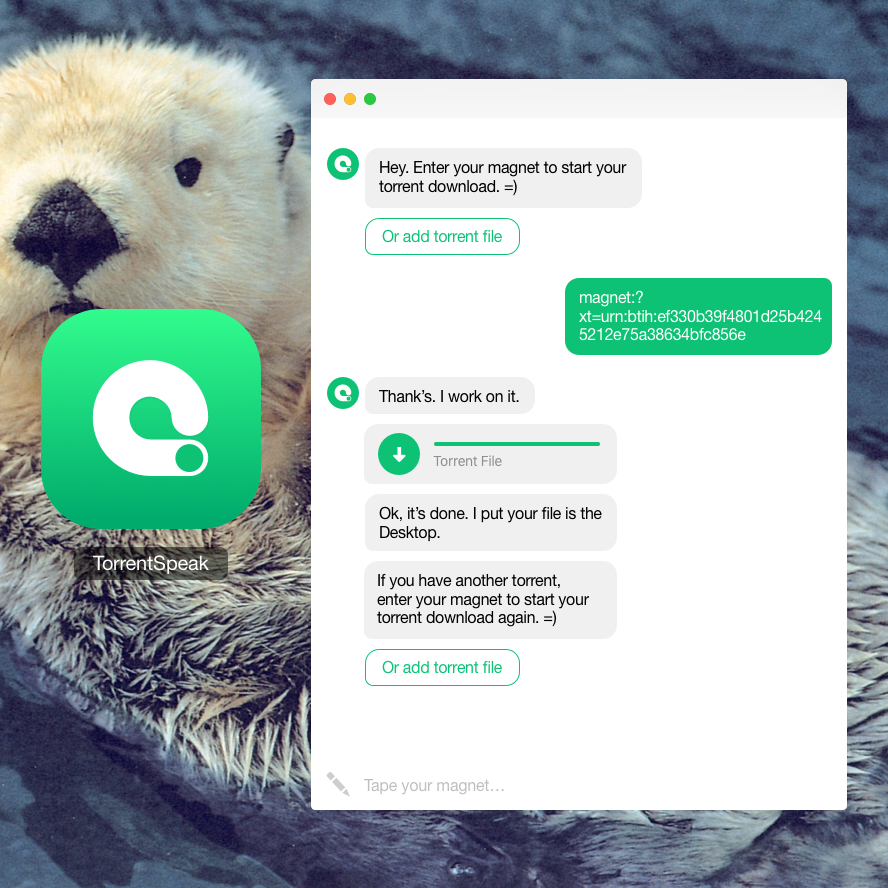

# TorrentSpeak
<center>

</center>

## Dev :

Install nwbuild, sass, node, npm, yarn, nodemon.

Install node_modules:
```bash
cd app
yarn
```

Run web:
```bash
cd app
npm run web
```
-> http://localhost:3000/

Run sass:
```bash
cd app
npm run sass
```

Run start:
```bash
cd app
npm run start
```

## Package your app for macOs:
```bash
cd app
npm run pack-mac
```
.app -> /dist/TorrentSpeak/osx64/
